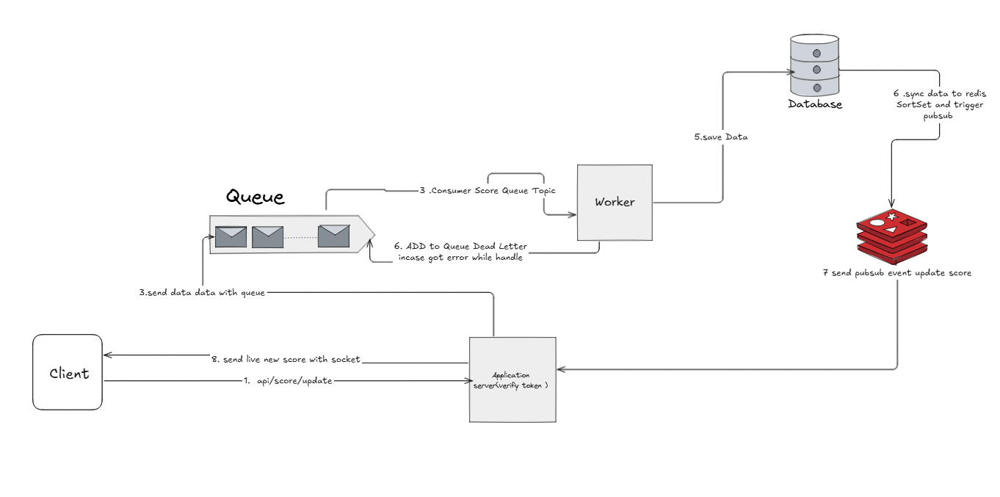

# 99_test Solution

## Table of Contents
- [Overview](#overview)
- [Problem 4: Sum to N Functions](#problem-4-sum-to-n-functions)
- [Problem 5: Express CRUD API](#problem-5-express-crud-api)
- [Problem 6: Live Scoreboard System Design](#problem-6-live-scoreboard-system-design)
- [Development & Testing](#development--testing)
- [Docker Usage](#docker-usage)
- [Linting & Formatting](#linting--formatting)

---

## Overview
This repository contains solutions for two problems:
- **Problem 4:** Simple TypeScript functions for summing numbers up to N, with tests.
- **Problem 5:** A full-stack backend CRUD API using Express, TypeScript, and PostgreSQL.
- **Problem 6:** A system design specification for a real-time scoreboard.

---

## Problem 4: Sum to N Functions
- **Location:** `src/problem4/`
- **Description:** Simple TypeScript functions for summing numbers up to N, with tests.
- **To Run Tests:**
  ```bash
  npm run test:problem4
  ```

---

## Problem 5: Express CRUD API
- **Location:** `src/problem5/`
- **Description:** A full-stack backend CRUD API using Express, TypeScript, Sequelize, PostgreSQL, Zod validation, logging, and Docker support.
- **API Endpoints:**
  - `POST   /items`
  - `GET    /items` (with filtering)
  - `GET    /items/:id`
  - `PUT    /items/:id`
  - `DELETE /items/:id`
- **To Run (Hot-Reload):**
  ```bash
  npm run dev:problem5
  ```
- **To Run Tests:**
  ```bash
  npm run test:problem5
  ```

---

## Problem 6: Live Scoreboard System Design

This document outlines the architecture for a real-time scoreboard system, designed for scalability and resilience.

### 1. Software Requirements
- The system must display a live scoreboard with the top 10 user scores.
- Score updates must be reflected in real-time without requiring a page refresh.
- A user action triggers an API call to update their score.
- The system must prevent unauthorized score updates.

### 2. Architecture Diagram



### 3. Data Flow Execution
1.  **Update Request:** The **Client** sends an authenticated `POST /api/score/update` request. The **Application Server** validates the user's token (e.g., JWT) to ensure they are authorized.
2.  **Asynchronous Processing:** To ensure a fast API response, the server immediately pushes a job with the score details to a **Queue**.
3.  **Job Consumption:** A separate **Worker** process consumes the job from the queue. This decouples the API from the data processing logic.
4.  **Data Persistence:** The worker saves the updated score to the primary **Database** (PostgreSQL). This is the source of truth.
5.  **Cache & Real-time Update:** After a successful database write, the data is synced to **Redis**. The user's new score is added to a **Sorted Set** (which efficiently maintains the top 10 scoreboard). A **Pub/Sub** event is then triggered.
6.  **Error Handling:** If the worker fails to process the message, it is moved to a **Dead Letter Queue (DLQ)** for later inspection and potential reprocessing.
7.  **Live Push to Client:** The **Application Server**, subscribed to the Redis Pub/Sub channel, receives the update event. It then pushes the new scoreboard data to all connected **Clients** via a WebSocket connection.

### 4. Recommendations for Implementation Team

*   **Idempotency:** The worker must be designed to be idempotent. If a message from the queue is processed more than once, it should not result in multiple score increases. This can be achieved by tracking processed job IDs in Redis or the database.
*   **Authentication:** Use JSON Web Tokens (JWT) for securing the API endpoint. The token should contain the `userId` to prevent users from updating scores for others.
*   **Scalability:**
    *   The Application Server and Worker processes are stateless and can be scaled horizontally (running multiple instances) to handle increased load.
    *   Use a managed Queue and Redis service for easier scaling of the messaging and caching layers.
*   **WebSocket Management:** When scaling the Application Server, a Redis Pub/Sub backplane is essential to broadcast WebSocket messages across all server instances to all connected clients.
*   **Dead Letter Queue Management:** Implement monitoring and alerting for the DLQ. Establish a clear process for analyzing and re-queueing failed jobs.

---

## Development & Testing

### 1. Install dependencies
```bash
npm install
```

### 2. Run tests
- **All Tests:** `npm test`
- **Specific Problem:** `npm run test:problem4` or `npm run test:problem5`

---

## Docker Usage
Build and start all services with hot-reload for development:
```bash
docker-compose up --build
```
- The API will be available at [http://localhost:3000](http://localhost:3000)
- Logs are written to `src/problem5/logs/app.log`

---

## Linting & Formatting
- **Lint:** `npm run lint`
- **Format:** `npm run format` 