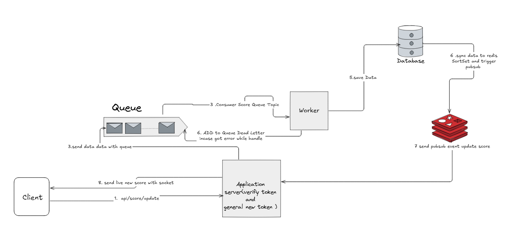

# 99_test Solution

## Table of Contents
- [Overview](#overview)
- [Getting Started](#getting-started)
- [Problem 4: Sum to N Functions](#problem-4-sum-to-n-functions)
- [Problem 5: Express CRUD API](#problem-5-express-crud-api)
- [Problem 6: Live Scoreboard System Design](#problem-6-live-scoreboard-system-design)

---

## Overview
This repository contains solutions for two problems:
- **Problem 4:** Simple TypeScript functions for summing numbers up to N, with tests.
- **Problem 5:** A full-stack backend CRUD API using Express, TypeScript, and PostgreSQL.
- **Problem 6:** A system design specification for a real-time scoreboard.

---

## Getting Started
First, install the required dependencies for all problems:
```bash
npm install
```

---

## Problem 4: Sum to N Functions
- **Location:** `src/problem4/`
- **Description:** Simple TypeScript functions for summing numbers up to N, with tests.
- **To Run Tests:**
  ```bash
  npm run test:problem4
  ```

---

## Problem 5: Express CRUD API
- **Location:** `src/problem5/`
- **Description:** A full-stack backend CRUD API using Express, TypeScript, and PostgreSQL. It features Sequelize for ORM, Zod for validation, Log4js for logging, and full Docker support.

### How to Run
- **With Docker (Recommended):**
  ```bash
  docker-compose up --build
  ```
  The API will be available at [http://localhost:3000/items](http://localhost:3000/items).

- **Locally (with Hot-Reload):**
  ```bash
  npm run dev:problem5
  ```

### How to Test
```bash
npm run test:problem5
```

### API Endpoints
| Method | Endpoint      | Description                               |
|--------|---------------|-------------------------------------------|
| `POST` | `/items`      | Create a new item.                        |
| `GET`  | `/items`      | List items with optional filters.         |
| `GET`  | `/items/:id`  | Get details of a single item.             |
| `PUT`  | `/items/:id`  | Update an existing item.                  |
| `DELETE`| `/items/:id`  | Delete an item.                           |

### Request Validation with Zod
This project uses **Zod** for type-safe validation of incoming request bodies.
- Validation logic is handled by a middleware in `src/problem5/middlewares/validate.ts`.
- Schemas can be defined and applied to routes to ensure that `POST` and `PUT` requests have the correct shape and data types before they reach the controller. This prevents invalid data from being processed and provides clear error messages.

### Query Filters for `GET /items`
| Query Param   | Type   | Description                                      | Example                      |
|---------------|--------|--------------------------------------------------|------------------------------|
| `name`        | string | Partial match on item name (case-insensitive).   | `?name=foo`                  |
| `description` | string | Partial match on item description (case-insensitive).| `?description=sample`        |
| `createdAt`   | date   | Exact match on creation date (YYYY-MM-DD).       | `?createdAt=2024-06-01`      |
| `createdFrom` | date   | Items created on or after this date (YYYY-MM-DD).| `?createdFrom=2024-01-01`    |
| `createdTo`   | date   | Items created on or before this date (YYYY-MM-DD).| `?createdTo=2024-06-01`      |

**You can combine multiple filters in a single request.**
Example: `/items?name=item&createdFrom=2024-01-01`

---

## Problem 6: Live Scoreboard System Design

This document outlines the architecture for a real-time scoreboard system, designed for scalability and resilience.

### 1. Software Requirements
- The system must display a live scoreboard with the top 10 user scores.
- Score updates must be reflected in real-time without requiring a page refresh.
- A user action triggers an API call to update their score.
- The system must prevent unauthorized score updates.

### 2. Architecture Diagram



### 3. Data Flow Execution
1.  **Update Request:** The **Client** sends an authenticated `POST /api/score/update` request. The **Application Server** validates the user's token (e.g., JWT) to ensure they are authorized.
2.  **Asynchronous Processing:** To ensure a fast API response, the server immediately pushes a job with the score details to a **Queue**.
3.  **Job Consumption:** A separate **Worker** process consumes the job from the queue. This decouples the API from the data processing logic.
4.  **Data Persistence:** The worker saves the updated score to the primary **Database** (PostgreSQL). This is the source of truth.
5.  **Cache & Real-time Update:** After a successful database write, the data is synced to **Redis**. The user's new score is added to a **Sorted Set** (which efficiently maintains the top 10 scoreboard). A **Pub/Sub** event is then triggered.
6.  **Error Handling:** If the worker fails to process the message, it is moved to a **Dead Letter Queue (DLQ)** for later inspection and potential reprocessing.
7.  **Live Push to Client:** The **Application Server**, subscribed to the Redis Pub/Sub channel, receives the update event. It then pushes the new scoreboard data to all connected **Clients** via a WebSocket connection.

### 4. Recommendations for Implementation Team

*   **Idempotency:** The worker must be designed to be idempotent. If a message from the queue is processed more than once, it should not result in multiple score increases. This can be achieved by tracking processed job IDs in Redis or the database.
*   **Authentication:** Use JSON Web Tokens (JWT) for securing the API endpoint. The token should contain the `userId` to prevent users from updating scores for others also general new token for after one time update for preventing from many client reuse the the same token.
*   **Scalability:**
    *   The Application Server and Worker processes are stateless and can be scaled horizontally (running multiple instances) to handle increased load.
    *   Use a managed Queue and Redis service for easier scaling of the messaging and caching layers.
*   **WebSocket Management:** When scaling the Application Server, a Redis Pub/Sub backplane is essential to broadcast WebSocket messages across all server instances to all connected clients.
*   **Dead Letter Queue Management:** Implement monitoring and alerting for the DLQ. Establish a clear process for analyzing and re-queueing failed jobs.

---